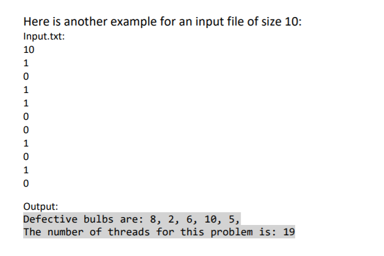
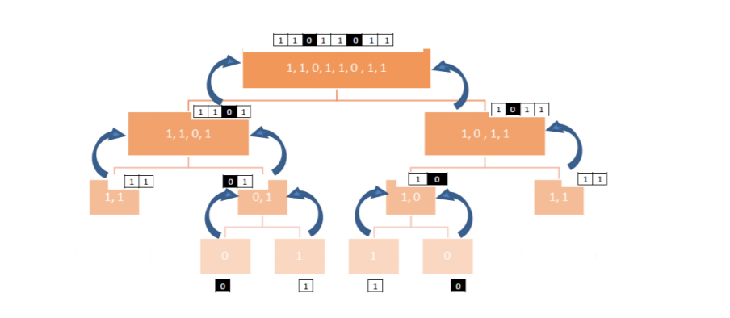

# Recursive traversal to find defective lightbulbs using multi-threading

Given a series of lightbulbs connected in a sequential manner, if one of the bulbs is defective it will cause all the bulbs to be off. A potential solution to find quickly the faulty bulb(s) is to divide recursively the series into subseries and keep investigating the subseries that do not show light. 

To solve this problem the goal here was to write a recursive threading method to find the defective bulbs and the number of threads that have been created for this purpose.

The code will be able to read an input text file and fill into an array of integers. The first line of input defines the size of the array (the number of bulbs) and status of each bulb is given in one line. The input will consist of two states of each bulb. The first being 0 to indicate the bulb is defective, and the second will be 1 to indicate the bulb is functioning properly. 

The main thread runs “FindDefective” function as a new thread and passes the input array to that thread. The main function should wait until FindDefective terminate and then print out the number of created threads in the program along with the list of defective bulbs.

The “FindDefective” function is responsible to select a “pivot” (𝑛𝑛2) and divide its input array (e.g. arr) into two sub-arrays (e.g. leftArr and rightArr). It will then call the “FindDefective” recursively by creating and starting the threads for the leftArr and rightArr. 

The main function should print out the content of “defectives” array when all the threads are terminated.

The recursion should be invoked as long as there is at least one defective bulb in the sub-series and the subseries is not lightning up.

Here is an example of an input file producing the following output.

Also, this diagram will provide a more comprehensive explaination of what the program will do.

